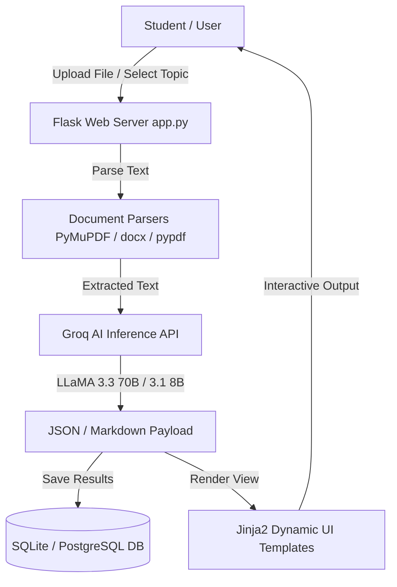

# 🎓 AI Student Learning Assistant

<div align="center">


**An intelligent, AI-powered web application that transforms study materials into interactive learning experiences — summaries, flashcards, adaptive quizzes, personalized study plans, and career navigation.**

[🐛 Report Bug](https://github.com/SnehaS1212/ai-student-learning-assistant/issues) · [✨ Request Feature](https://github.com/SnehaS1212/ai-student-learning-assistant/issues)

</div>

---

## 📋 Table of Contents

- [Overview](#-overview)
- [System Architecture](#-system-architecture)
- [Documentation & Presentation](#-documentation--presentation)
- [Key Features](#-key-features)
- [Tech Stack](#-tech-stack)
- [AI Models Used](#-ai-models-used)
- [Getting Started](#-getting-started)
  - [Prerequisites](#prerequisites)
  - [Installation](#installation)
  - [Environment Variables](#environment-variables)
  - [Running Locally](#running-locally)
- [Project Structure](#-project-structure)
- [Database Schema](#-database-schema)
- [Contributing](#-contributing)
- [License](#-license)

---

## 🌟 Overview

The **AI Student Learning Assistant** is a full-stack Flask web application powered by **Groq's ultra-fast LLM inference engines**. Students can upload any study document — PDF, DOCX, TXT, Markdown, or Images — and instantly access a suit of AI-powered educational tools:

- 📝 **4 Summary Modes**: Detailed, Short, Exam Revision, and One-Page Cheat Sheet
- 🃏 **Interactive Flashcards**: Flip card interface with spaced repetition scheduling
- 🧠 **Adaptive Quizzes**: Custom question counts with Easy, Medium, and Hard difficulties
- 📊 **Performance Analytics**: Visual score tracking, weak topic identification, and exam readiness scores
- 🗓 **Personalized Study Plans**: 1-Day, 3-Day, and 7-Day action plans tailored to quiz results
- 🎓 **AI Tutor Feedback**: Detailed per-question explanations and concept breakdowns
- 🔬 **AI Research Lab & Career Navigator**: Advanced academic assistance and personalized career path guidance

---

## 🏗 System Architecture



---

## 📄 Documentation & Presentation

| Document | Link | Description |
| :--- | :--- | :--- |
| 📊 **Presentation (PPT)** | [internship ppt.pptx](./docs/internship%20ppt.pptx) | Final Internship Presentation Slides |
| 📑 **Internship Report** | [internship report.docx](./docs/internship%20report.docx) | Comprehensive Internship Project Report |
| 📅 **Daily Internship Log** | [daily log.pdf](./logs/daily%20log.pdf) | Daily Internship Log & Activity Record |

---

## ✨ Key Features

| Feature | Category | Description |
|---|---|---|
| **📁 Multi-Format Ingestion** | File Upload | Processes PDF, DOCX, DOC, TXT, MD, PNG, JPG, and JPEG documents |
| **🤖 4-in-1 AI Summarizer** | AI Content | Generates Detailed, Short, Exam Revision, and One-Page cheat sheet notes |
| **🃏 Flashcards Player** | Interactive | Creates flip-cards with spaced repetition flashcard review modes |
| **📝 Adaptive Quiz Engine** | Assessment | MCQ quizzes with difficulty tuning, instant scoring, and tutor feedback |
| **📊 Performance Analytics** | Analytics | Identifies weak topics, tracks readiness score (0-100), and calculates confidence level |
| **🗓 AI Study Planner** | Planning | Auto-generates structured 1-Day, 3-Day, and 7-Day study schedules based on quiz performance |
| **🏆 Student Leaderboard** | Gamification | Displays student score rankings and competitive leaderboard positions |
| **🔬 AI Research Lab** | Research | Assists students with lit reviews, hypotheses generation, and research paper summaries |
| **🧭 Career Navigator** | Guidance | Analyzes student academic performance to suggest tailored career roadmaps |
| **📈 GPA Predictor** | Tools | Predicts future academic performance based on target courses and current grades |
| **⚙️ Admin Dashboard** | Admin | Admin panel for system analytics, dataset management, and user oversight |

---

## 🛠 Tech Stack

### Backend & Core
- **[Flask 3.1.1](https://flask.palletsprojects.com/)** — Lightweight Python WSGI web application framework
- **[Groq SDK](https://console.groq.com/)** — High-speed LLM API integration engine
- **[PyMuPDF (fitz)](https://pymupdf.readthedocs.io/)** — Fast PDF document parsing and text extraction
- **[pypdf](https://pypdf.readthedocs.io/)** — Pure Python PDF utility library
- **[python-docx](https://python-docx.readthedocs.io/)** — Microsoft Word document parser
- **[SQLite3](https://docs.python.org/3/library/sqlite3.html)** — Embedded relational database for local development
- **[psycopg2-binary](https://www.psycopg.org/)** — PostgreSQL database adapter for production deployment
- **[Gunicorn 23.0.0](https://gunicorn.org/)** — Production WSGI HTTP Server

### Frontend & Styling
- **HTML5 & CSS3** — Responsive UI design with modern dark mode aesthetic
- **Vanilla JavaScript (ES6+)** — Asynchronous client-side interactions and dynamic content rendering
- **Jinja2** — Server-side HTML template rendering engine

---

## 🤖 AI Models Used

| Model Name | Role & Responsibility | Key Advantage |
|---|---|---|
| `llama-3.3-70b-versatile` | Primary intelligence model for summaries, flashcards, quizzes, study plans, and career guidance | Superior reasoning accuracy and deep context understanding |
| `llama-3.1-8b-instant` | Lightweight fallback model for high-throughput sub-tasks | Extremely low latency response time |
| `meta-llama/llama-4-scout-17b-16e-instruct` | Vision model for OCR & image text processing | Accurate document text extraction from uploaded images |

---

## 🚀 Getting Started

### Prerequisites

Ensure you have the following installed on your local machine:
- **Python 3.10+**
- **pip** package manager
- A **[Groq API Key](https://console.groq.com/)** (Free tier available)

---

### Installation

1. **Clone the repository**
   ```bash
   git clone https://github.com/SnehaS1212/ai-student-learning-assistant.git
   cd ai-student-learning-assistant
   ```

2. **Create & activate a virtual environment**
   ```bash
   # Windows (PowerShell)
   python -m venv venv
   .\venv\Scripts\activate

   # macOS / Linux
   python -m venv venv
   source venv/bin/activate
   ```

3. **Install required dependencies**
   ```bash
   pip install -r requirements.txt
   ```

---

### Environment Variables

Create a `.env` file in the root directory of the project:

```env
# Required: Your Groq API Key
GROQ_API_KEY=gsk_your_groq_api_key_here

# Optional: Flask Secret Key (Auto-generated fallback used if omitted)
FLASK_SECRET_KEY=your_custom_secret_key_here
```

> ⚠️ **Note:** Do not commit the `.env` file to version control. It is already included in `.gitignore`.

---

### Running Locally

Execute the Flask application:

```bash
python app.py
```

Open your browser and navigate to:
```
http://localhost:5000
```

---

## 📁 Project Structure

```
ai-student-learning-assistant/
│
├── app.py                      # Core Flask backend (routes, AI integration, DB operations)
├── requirements.txt            # Python package dependencies
├── .env                        # Local environment variables (Git-ignored)
├── .gitignore                  # Git untracked file rules
├── README.md                   # Project documentation
│
├── docs/                       # Internship documentation & presentation
│   ├── internship ppt.pptx     # Final internship presentation slides
│   └── internship report.docx  # Comprehensive internship project report
│
├── datasets/                   # Sample datasets & question banks
│   ├── quiz_question_bank.json # Pre-configured quiz questions
│   ├── sample_documents/       # Sample reference PDFs
│   ├── sample_study_materials.json
│   └── student_performance_dataset.csv
│
├── logs/                       # Activity & runtime logs
│   ├── app.log                 # Flask application runtime execution log
│   └── daily log.pdf           # Daily internship activity log document
│
├── templates/                  # Jinja2 HTML View Templates
│   ├── base.html               # Main layout wrapper & navigation bar
│   ├── index.html              # Home Dashboard & File Upload hub
│   ├── summary.html            # AI summary display page
│   ├── flashcards.html         # Interactive flip flashcard viewer
│   ├── quiz_setup.html         # Quiz configuration panel
│   ├── quiz.html               # MCQ quiz portal
│   ├── result.html             # Quiz performance analytics & readiness score
│   ├── study_plan.html         # 1D/3D/7D personalized study schedule
│   ├── leaderboard.html        # Score rankings & student leaderboard
│   ├── certificate.html        # Course completion certificate
│   ├── spaced_repetition.html  # Spaced repetition flashcard schedule
│   ├── career_navigator.html   # AI career roadmap builder
│   ├── research_lab.html       # AI academic research assistant
│   ├── gpa_predictor.html      # Grade & GPA predictor tool
│   └── admin_panel.html        # System administration panel
│
├── static/                     # Static Web Assets
│   ├── css/                    # Custom stylesheets (style.css)
│   └── js/                     # Client-side JavaScript scripts
│
├── uploads/                    # User uploaded documents (Git-ignored)
└── database.db                 # Local SQLite database (Git-ignored)
```

---

## 🗃 Database Schema

### 1. `materials` Table
Stores uploaded student study files, extracted raw text, and generated summary variants.

| Column | Data Type | Constraint | Description |
|---|---|---|---|
| `id` | INTEGER | Primary Key | Auto-increment identifier |
| `filename` | TEXT | Not Null | Original uploaded file name |
| `filepath` | TEXT | Not Null | Disk storage path |
| `extracted_text` | TEXT | | Raw text extracted from document |
| `summary_detailed` | TEXT | | Comprehensive multi-page summary |
| `summary_short` | TEXT | | Concise 2-3 sentence overview |
| `summary_revision` | TEXT | | Key bullet points for quick exam revision |
| `summary_onepage` | TEXT | | Cheat-sheet format summary |
| `created_at` | DATETIME | Default NOW | File upload timestamp |

---

### 2. `flashcards` Table
Contains flashcard questions and answers generated for uploaded study materials.

| Column | Data Type | Constraint | Description |
|---|---|---|---|
| `id` | INTEGER | Primary Key | Auto-increment identifier |
| `material_id` | INTEGER | Foreign Key | References `materials.id` |
| `front` | TEXT | Not Null | Question / Prompt |
| `back` | TEXT | Not Null | Answer / Explanation |

---

### 3. `quiz_results` Table
Tracks quiz submissions, individual student performance, readiness metrics, and AI tutor feedback.

| Column | Data Type | Description |
|---|---|---|
| `id` | INTEGER PK | Auto-increment identifier |
| `username` | TEXT | Student / User name |
| `filename` | TEXT | Source material name |
| `topic` | TEXT | Quiz topic |
| `difficulty` | TEXT | Quiz difficulty level (Easy / Medium / Hard) |
| `score` | INTEGER | Number of correct answers |
| `total` | INTEGER | Total question count |
| `percentage` | REAL | Calculated score percentage |
| `weak_topics` | TEXT (JSON) | Array of identified weak learning areas |
| `study_plan_1d` | TEXT (JSON) | 1-Day revision schedule |
| `study_plan_3d` | TEXT (JSON) | 3-Day revision schedule |
| `study_plan_7d` | TEXT (JSON) | 7-Day revision schedule |
| `readiness_score` | INTEGER | AI calculated readiness score (0-100) |
| `confidence` | TEXT | Exam confidence level (Low / Medium / High) |
| `tutor_feedback` | TEXT (JSON) | Per-question AI tutor explanations |
| `timestamp` | DATETIME | Submission date and time |

---

## 🤝 Contributing

Contributions make the open-source community an amazing place to learn, inspire, and create. Any contributions you make are **greatly appreciated**.

1. **Fork** the Repository
2. **Create** your Feature Branch (`git checkout -b feature/AmazingFeature`)
3. **Commit** your Changes (`git commit -m 'Add some AmazingFeature'`)
4. **Push** to the Branch (`git push origin feature/AmazingFeature`)
5. **Open** a Pull Request

---

## 📄 License

Distributed under the **MIT License**. See [`LICENSE`](LICENSE) for more information.

---

<div align="center">

Made with ❤️ by **[Sneha S](https://github.com/SnehaS1212)**

</div>
